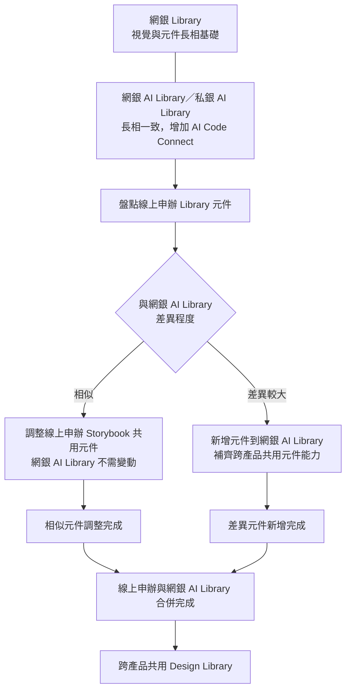

# UED Web Team｜設計團隊分工與發展規劃

## 1. 團隊分工原則

### 廠商設計師｜**專案 Owner**

以完整專案為責任單位，而非零碎需求的執行支援。

- 可獨立負責完整專案
- 進行需求分析與問題釐清
- 獨立完成 UX / UI 設計
- 與 PM、PO、RD 等角色協作
- 負責設計交付與 Design QA
- 對專案設計成果負責
- 持續累積完整產品經驗與設計能力

### 正職設計師｜**產品／平台 Owner**

以產品／平台為責任單位，負責整體設計方向與跨團隊協作。

- 負責產品／平台整體設計方向
- 與內部利害關係人溝通
- 決策重要設計議題
- 跨團隊、跨產品協調
- Design Library 管理
- 掌握產品／平台的設計品質與一致性

> 兩個角色皆有設計執行的任務，但**角色差異在於組織責任、決策權與協調範圍，而不是設計能力或工作量高低。**

---

## 2. 目前產品與開發模式

| 平台／類型 | 產品 | 開發模式 | Library 現況 |
|---|---|---|---|
| 網銀平台 | 網銀 | Agile／2 週 | 最完整，作為 Core Library 基礎；與網銀 AI Library 長相一致 |
| 網銀平台 | 私人銀行 | AI Scrum／1 週 | 使用私銀 AI Library（同網銀 AI Library，含 AI Code Connect） |
| 線上申辦平台 | 線上申辦 | Agile／2 週 | 有自己的 Library，與網銀接近 |
| 線上申辦平台 | 線上申辦 AI | AI Scrum／1 週 | 新起步，開始與網銀 AI Library 元件拉齊 |
| 線上申辦平台 | 信貸 | 視專案而定 | 依線上申辦平台發展 |
| 線上申辦平台 | 虛擬資產 | 視專案而定 | 依線上申辦平台發展 |
| ROBO 平台 | ROBO | Agile／2 週 | 有自己的 Library |
| 非平台型任務 | UX Lab | — | 非平台 |
| 非平台型任務 | 卡經 EDM | — | 非平台 |

---

## 3. 網銀/私銀/線上申辦 Library 發展方向

目前不建議各平台各自發展成完全獨立的 Library，而是逐步形成共享的 **Design Library**。

主要以**網銀平台**與**線上申辦平台**為核心，建立可跨產品共用的 **Design Library**。

- **網銀**：Library 最完整，作為核心 Components 的基礎；網銀 Library 與網銀 AI Library 長相一致，差異在於網銀 AI Library 多了 AI Code Connect
- **私人銀行 AI**：使用私銀 AI Library，私銀 AI Library 即網銀 AI Library；AI 版本增加 AI Code Connect 設定，但視覺與元件長相一致
- **線上申辦**：已有自己的 Library，與網銀 Library／網銀 AI Library 高度接近，需依元件差異程度分流處理
- **線上申辦 AI**：剛開始發展，應逐步採用網銀 AI Library 元件，並整理前端元件調整規格

### 未來方向

以**網銀 Library**為視覺與元件基礎，並以**網銀 AI Library／私銀 AI Library**承接 AI Code Connect 經驗，逐步整合線上申辦與私人銀行 AI 的元件與 AI 使用經驗，建立跨產品共享的 **Design Library**。

- **網銀**：作為核心 Components 的基礎
- **線上申辦**：逐步與網銀 AI Library 元件對齊
- **私人銀行 AI／線上申辦 AI**：對齊網銀 AI Library 元件，並累積 AI 元件與應用經驗

### 線上申辦與網銀 AI Library 合併判準

線上申辦元件整合分為兩種情況：

1. **與網銀 AI Library 相似的元件**
   - 網銀 AI Library 不需變動
   - 請前端調整線上申辦 Storybook 的共用元件
   - 讓線上申辦可直接沿用或微調共用規格

2. **與網銀 AI Library 差異較大的元件**
   - 無法使用網銀既有元件
   - 也無法透過微調共用元件解決
   - 需新增元件到網銀 AI Library，補齊跨產品可共用的元件能力

以上兩個部分都完成後，才算完成線上申辦與網銀 AI Library 的合併。

> **最終目標：以網銀平台與線上申辦平台為主，建立可跨產品共用的 Design Library，並完成線上申辦與網銀 AI Library 的元件合併。**

Library 由團隊共同維護，各產品 Designer 共同貢獻，避免形成單一人員依賴。

---

## 4. 新人的定位與階段發展

王仕和為內部轉調設計師，過去於資訊策略發展部負責中台、Web 任務牆、後台 CUBE 權益平台等系統型產品。

### Phase 1｜短期：線上申辦專案＋線上申辦與網銀 AI Library 整合

**主要任務**
- 承接線上申辦專案，建立產品與業務脈絡
- 參與線上申辦 AI 專案
- 盤點線上申辦與網銀 AI Library 差異，並區分為「可共用微調」與「需新增元件」兩類
- 開始推動兩平台元件對齊
- 請前端調整線上申辦 Storybook 共用元件
- 針對差異較大的元件，整理新增至網銀 AI Library 的規格
- 整理元件調整與前端開發規格
- 與網銀 Designer、RD 共同確認共用元件的設計與技術規格

**階段目標**

> 承接線上申辦專案，盤點線上申辦與網銀 AI Library 差異，完成可共用微調與需新增元件的分流，建立跨產品 Design Library 思維。

### Phase 2｜中期：線上申辦平台設計 Owner ＋ 網銀專案

**2027 Q1 增加網銀完整專案責任，推進元件整合，理解不同 PM、RD、Scrum 團隊的協作模式。**

**主要任務**
- 主責線上申辦平台整體設計方向與品質一致性
- 承接網銀完整專案，建立 Agile 開發經驗
- 持續負責線上申辦相關專案
- 累積與不同 PM、RD、Scrum 團隊協作經驗

**階段目標**

> 成為線上申辦平台設計 Owner，並具備獨立承接網銀完整專案的能力。

### Phase 3｜長期：Web 跨產品能力（網銀平台設計 Owner？）

**主要任務**
- 持續推進網銀／線上申辦元件整合
- 參與私人銀行 AI 使用私銀 AI Library（同網銀 AI Library）的相關議題
- 處理不同產品間 Component、Design Token 差異
- 協調跨產品設計議題並推動設計一致性
- 視團隊發展與產品需求，評估承接網銀平台設計 Owner

**階段目標**

> 具備 Web 跨產品設計與協調能力，並將網銀平台設計 Owner 作為可能的發展方向。

---

## 5. 團隊角色定位

正職設計師皆為**平台設計 Owner**，廠商設計師皆為**專案設計 Owner**。

### 正職｜平台設計 Owner

| 設計師 | 主要定位 |
|---|---|
| 王詩容 | 網銀平台 Owner / Web Team 設計管理 / 跨平台設計溝通 / 線上申辦 AI |
| 薛馮慈 | 私人銀行平台 Owner／AI |
| 鄭筑友 | ROBO 平台 Owner／AI／UX Lab |
| 王仕和 | 線上申辦專案與元件整合 → 線上申辦平台設計 Owner ＋ 網銀專案 → Web 跨產品能力（網銀平台設計 Owner？） |

### 廠商｜專案設計 Owner

| 設計師 | 主要定位 |
|---|---|
| 謝明卲 | 網銀專案 Owner |
| 黃霈仁 | 網銀專案 Owner |
| 沈子翔 | 網銀／線上申辦跨產品專案 Owner |
| 林庭郁 | ROBO 專案 Owner |

### 共同原則

每位 Designer 都應至少有一個明確的「主責產品／專案」，並完整參與：

**需求 → 分析 → 設計 → 協作 → 開發 → QA → 上線**

同時依角色不同，承擔不同層級的責任：

**廠商** → 專案設計 Ownership  
**正職** → 平台設計 Ownership + 內部協調 + 設計決策 + Design Library 管理

---
## 6. 長期團隊發展方向

### Product Ownership
每個產品都有明確 Designer Owner，確保每位設計師都有完整專案經驗。

各產品 Designer 共同貢獻，不讓能力集中在單一人身上。

### 正職｜產品／平台設計 Owner
能承擔更高層級的設計決策與組織責任
- 掌握產品／平台整體設計方向
- 決策重要設計議題
- 負責跨團隊、跨產品協調

### 廠商｜專案設計 Owner
獨立承擔完整專案
- 進行需求分析與問題釐清
- 負責 UX / UI 設計與交付
- 執行 Design QA 並對成果負責

### 所有 Designer
持續成長，維持設計能力與工作負荷
- 累積完整專案經驗
- 共同貢獻 Design Library 與方法

### 最終目標

> **避免廠商長期只接零碎需求造成能力斷層與工作負荷失衡，讓所有 Designer 持續成長。**
> **正職能承擔更高層級的設計決策與組織責任，廠商能獨立承擔完整專案，同時所有 Designer 都能持續成長、維持相近的設計能力與工作負荷的團隊。**
---
